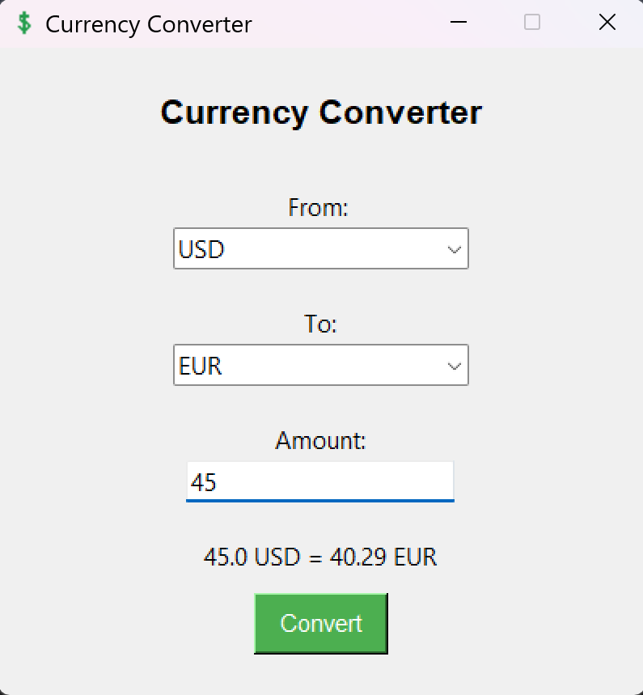

# 💱 💱 Currency Converter – PocketRates v1.2

A clean, modern currency converter built in Python with Tkinter and live rates via ExchangeRate-API. Now includes country flags, swap functionality, and a polished app-style interface.

---

## 🖼️ Preview



---

## 🚀 Features

✅ Real-time currency conversion using ExchangeRate-API

✅ Clean, styled GUI with white theme

✅ Country flags shown for selected currencies

✅ Currency swap button with icon

✅ Press Enter to convert

✅ Copy result to clipboard with one click

✅ Stars & Store badges styled footer

✅ Custom app icon and GUI layout

✅ Credit footer with name and copyright

✅ Conversion logs saved in conversion_history.txt

## 🛠 How to Run

1. Clone the repo or download the files
2. Install dependencies:

```bash
pip install requests python-dotenv pillow pyperclip
```

3. Add your API key to a .env file:

```bash
API_KEY=your_api_key_here
```

4. Run the app:
   python gui_converter.py
