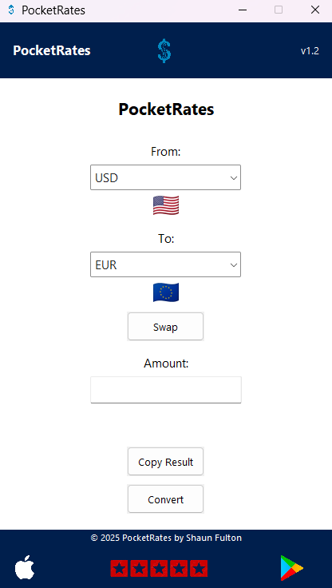

# 💱 PocketRates – v1.2

A clean, modern currency converter built with Python and Tkinter using live rates from ExchangeRate-API. Includes country flags, swap functionality, and a polished app-style interface.

---

## 🖼️ Preview



---

## 🚀 Features

✅ Real-time currency conversion (ExchangeRate-API)
✅ Clean white-themed GUI
✅ Country flags for selected currencies
✅ Swap button with icon
✅ Press Enter to convert
✅ One-click copy to clipboard
✅ Footer with 5-star badge and store icons
✅ Custom app icon and layout
✅ Credit footer (© 2025 Shaun Fulton)
✅ Conversion logs in `conversion_history.txt`

---

## 🛠 How to Run

1. Clone the repo or download the files
2. Install dependencies:

```bash
pip install requests python-dotenv pillow pyperclip
```
